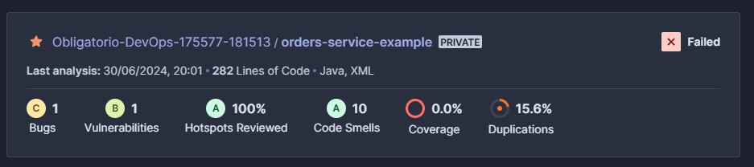

    
    

<!-- Esto es un espaciado usando una línea en blanco -->

   
   # Obligatorio DevOps

#### Integrantes del equipo:

Damián Ariztimuño - Hugo Borgiani

Tutor: Federico Barceló

2024

## Caso de Estudio

Durante la transformación digital de una empresa líder en retail, surgió un desafío significativo que reveló una brecha en la comprensión y comunicación entre los equipos de desarrollo y operaciones. Este problema se hizo evidente cuando los lanzamientos de una nueva aplicación, destinada a mejorar la experiencia de compra, resultaban en errores y caídas del sistema, afectando la experiencia del usuario y la reputación de la empresa. El conflicto no era técnico, sino cultural y organizativo, debido a la falta de colaboración entre los equipos que mantenían roles separados y prioridades conflictivas. La dirección ejecutiva reconoció que la solución al problema requería un cambio cultural profundo para alinear a todos los equipos bajo objetivos y prácticas comunes, más allá de meros ajustes técnicos.

## Planteamiento para la resolución del problema
Para resolver el problema, el equipo pretende adoptar una metodología DevOps, así, de esta forma, podrá integrar los diferentes flujos de trabajo de los equipos de desarrollo y operaciones, automatizarlos, y de esta forma disminuir la cantidad de errores sufridos durante los variados procesos y mejorando su time-to-market.

El mayor desafío se presenta en relación a gran variedad de herramientas existentes y la elección de las mismas y al correcto uso de estas.

## Objetivos generales y específicos
Se plantea como objetivos generales desplegar la infraestructura del proyecto en la nube, de manera que esta quede alojada de manera pública y accesible, y a su vez, aprovechando las bondades que esta brinda, como pueden ser la escalabilidad, la estabilidad y la eficiencia.

#### Como objetivos específicos podemos destacar:
- Estudiar las diferentes herramientas existentes en pos de seleccionar cuáles de estas son las que más se adecúan a las necesidades del cliente y a las complejidades que conlleva disponibilizar la infraestructura en la nube.
- Optimiazar los procesos de deploy para todos los aplicativos con el objectivo de disminuir el time-to-market y disponibilizarlos de manera continua para el usuario final
- Realizar análisis de código estático en pos de poseer un código limpio y mantenible, reduciendo los code smells y la repetición de código, y a su vez fomentando la detección temprana de bugs.
- Utilizar la metodología GitOps. A través de ella pretendemos utilizar el versionado de Git como la única fuente confiable de código y realizar deploys de manera automatizada.
- Aplicar testing automatizado con un enfoque end-to-end para verificar flujos funcionales a nivel de toda la aplicación, y reduciendo los tiempos de regresión para el equipo de testing manual, previo a la las salidas a producción.

El mayor desafío se presenta en relación a gran variedad de herramientas existentes y la elección de las mismas y al correcto uso de estas.

## Herramientas utilizadas
A continuación se detallan las tecnologías y herramientas utlilizadas para elaborar la solución

-**Git**: Se utilizará Git como tecnología de control y versionado de archivos

-**GitHub**: El uso de GitHub implica el almacenamiento de los diferentes repositorios en la nube, facilitando un acceso directo a los mismos.

-**GutHub Actions**: Se considera el uso de GitHub Actions para la implemantación de las estrategias de CI/CD, además de ya estar integrada con GitHub, lo cual facilita su uso.

-**Sonar Cloud**: El uso de Sonar Cloud estára limitado al análisis de código estático contenido en los diferentes repositorios.

-**Terraform**: Se plantea el uso de terraform para definir la infraestructura como código (IaC).

-**Playwright**: Plawright será usado como herramienta de testing E2E (End to End), debido a su fácil despliegue e integración con GitHub Actions.

## Repositorios y estrategias de ramas
El proyecto constará de un repositorio para cada microservicio y para almacenar el código de FrontEnd, bajo una estrategia de GitFlow. A su vez, para almacenar el plan de pruebas y los archivos necesarios para los despliegues y configuraciones de ambientes (los Archivos de DevOps), manejaremos una estrategia de Trunk Based.

### Repositorios de Frontend y Microservicios.

    

Para manejar de forma eficaz el desarrollo y la implementación de actualizaciones, hemos adoptado la estregia de GitFlow, en la cual denifimos 3 ramas estables (Production, Staging, Develop) y ramas fix (Hotfix y Bugfix). Asimismo, implementaremos las features necesarias para el desarrollo de nuevas características, basadas en la rama Develop. De esta forma pretendemos proporcionar un marco robusto y estructurado para la gestión de versiones y ramas.

### Repositorio de DevOps y Testing

El Repositorio de DevOps es fundamental para nuestra gestión de infraestructura como código (IaC). y para los procesos que configuran nuestro ciclo de despliegue continuo (CD). Este repositorio se gestiona utilizando la estrategia Trunk Based, en la cual disponemos de una única rama estable (Main/Master) que siempre contendrá la versión más actualizada del código, y ramas efímeras para las features, facilitando una integración y despliegue ágil y eficiente.

A su vez, el equpio de Atuomatización trabajará de una manera similar sobre su repositorio, integrando los diferentes casos de prueba en ramas efímeras que posteriormente se mezclarár con la rama principal

    

## Etapas de CI/CD

### Análisis de código estático

A través de la herramienta SonarCloud, se realizó análisis de código estático sobre cada uno de los repositorios principales (Frontend, orders-service, shipping-service, products-service y payments-service). Este análisis es ejecutado cada vez que se realiza un pull request sobre cada una de las ramas principales (develop, staging y production), y cuando se integra el código a cada una de ellas.

Dicho análisis es requerido para relizar los subsecuentes pasos dentro del proceso de integración y deploy de cada uno de los repositorios, por lo cual, si el análisis falla, el proceso se interrumpe.

#### Resultados obtenidos

Para la mayoría de los repositorios donde se corrió el análisis, las conclusiones fueron positivos, ya que en 4 de los 5 repositorios, el resultado obtenido fue de "**Passed**".

    

A pesar de dicho resultado, varios repositorios reportaron Code Smells, que, aunque no provoquen la detención de una salida a producción, si sería recomendable mejorar el código para poder eliminarlos, generando así u código mejor estructurado y mantenible.

Cabe destacar también que el análisis detectó 2 bugs, 1 en el microservicio de orders de categoria (**C**) y otro en el microservicio de payments de categoría (**D**). Si bien estos bugs no son críticos, si consideramos importante el foco en ellos ya que tienen potencial para provocar fallos en sus respectivos microservicios.

También debemos destacar el código del microservicio de orders no pasó el quality gate establecido por SonarCloud, por lo que consideramos imperante revisar el código de manera urgente y trabjar sobre los problemas evidenciados por la herramienta para poder integrar un código limpio, ordenado y sin fallas a los diferentes ambientes.

    

&nbsp

    

&nbsp

    

